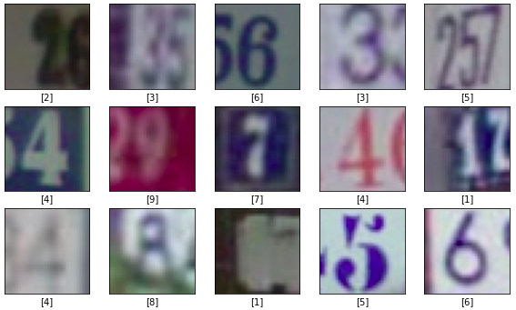
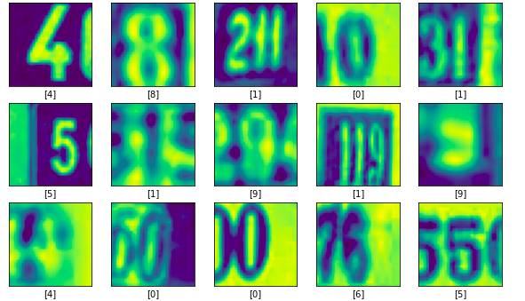
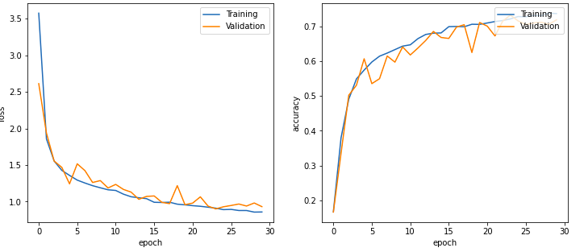
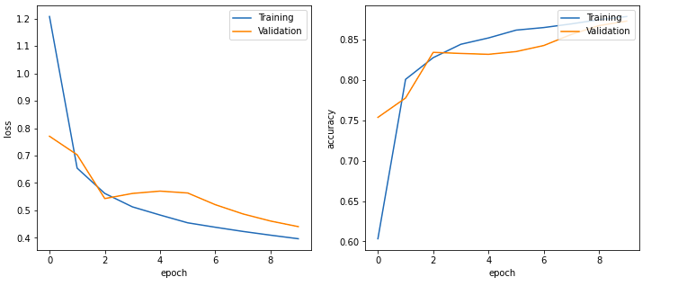
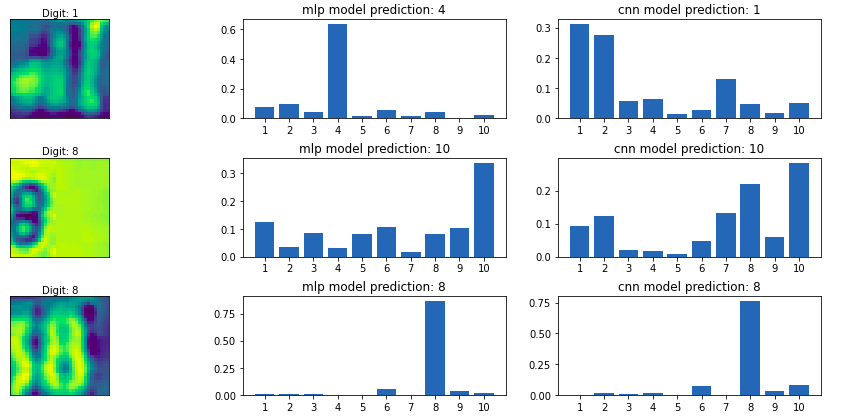

# Image-classifier-for-SVHN-dataset

## Why to do this project?
* To understand the difference between the performance of MLP and CNN model on image datasets.
* To brush up skills in MLP and CNN model construction, training, evaluation and prediction using Tensorflow 2.2.0
* Preprocessing and prediction part also brush up your skills in using numpy and matplotlib.

## SVHN Dataset
SVHN is a real-world image dataset for developing machine learning and object recognition algorithms with minimal requirement on data preprocessing and formatting.
It comes from a significantly harder, unsolved, real world problem (recognizing digits and numbers in natural scene images). SVHN is obtained from house numbers in Google Street View images.

Dataset is available at this link: [`Training Dataset`](http://ufldl.stanford.edu/housenumbers/train_32x32.mat) , [`Test Dataset`](http://ufldl.stanford.edu/housenumbers/test_32x32.mat)

**Overview**
* 10 classes, 1 for each digit. Digit '1' has label 1, '9' has label 9 and '0' has label 10.
* Dataset contain RGB images of size 32x32 and labels corresponding to them. 
* There are 73257 training examples and 26023 test examples. 
* The images in the Dataset is shown below.

## Implementation
### Preprocessing
  * Import the Dataset and extract the images and labels.
  * Change label 10 to 0 that is exception present in dataset.
  * convert dataset from channels first to channels last.
  * convert RGB images into Grey Scale Image
  * Plot images with labels for better visualization
  * Color Images are shown below:
  *  
  * Grey Scale Images are shown below:
  * 
### Model and Training
* There are two simple models used, one is MLP and other is CNN. 
* MLP model contains 146,026 parameters and trained for 30 epochs.
* Training of MLP model results with a `LOSS: 0.8575 and ACCURACY: 0.7361 and VAL LOSS: 0.9304 and VAL ACCURACY: 0.7183`
* Training Statitics of MLP model are shown below:
* 
* CNN model contains 30,954 parameters and trained for 10 epochs.
* Training of MLP model results with a `LOSS: 0.3966 and ACCURACY: 0.8789 and VAL LOSS: 0.4408 and VAL ACCURACY: 0.8732`
* Training Statitics of CNN model are shown below:
* 
* In Training we can observe the better performance of CNN over an MLP model.
### Evaluation
* MLP model evaluation on test set `LOSS: 1.0645 and ACCURACY: 0.6939`
* CNN model evaluation on test set `LOSS: 0.4665 and ACCURACY: 0.8707`
### Results
* The performance of CNN with fewer parameter and fewer training epochs is far better then the MLP model.
* One reason of that is CNN is better at generalising its learning at one part of image to other part of image due to shared parameters.
### Prediction
* Some random prediction from these models are shown.

