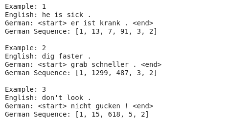

# Neural-Translation

## Why to do this project?
* You will create a neural network that translates from English to German.
* You will use concepts including building more flexible model architectures, freezing layers, data processing pipeline and sequence modelling.
* To brush up skills in model construction, training, evaluation and prediction using lower level API of Tensorflow 2.2.0
* Preprocessing and prediction part also brush up your skills in using re and numpy modules in python.

## Language Dataset
* We will use a language dataset from http://www.manythings.org/anki/ to build a neural translation model.
* This dataset consists of over 200,000 pairs of sentences in English and German. 
* In order to make the training quicker, we will restrict to our dataset to 20,000 pairs. Feel free to change this if you wish.

### How the data looks

English + TAB + The Other Language + TAB + Attribution
* This work isn't easy.	この仕事は簡単じゃない。	CC-BY 2.0 (France) Attribution: tatoeba.org #3737550 (CK) & #7977622 (Ninja)
* Those are sunflowers.	それはひまわりです。	CC-BY 2.0 (France) Attribution: tatoeba.org #441940 (CK) & #205407 (arnab)
* Tom bought a new car.	トムは新車を買った。	CC-BY 2.0 (France) Attribution: tatoeba.org #1026984 (CK) & #2733633 (tommy_san)
* This watch is broken.	この時計は壊れている。	CC-BY 2.0 (France) Attribution: tatoeba.org #58929 (CK) & #221604 (bunbuku)

### Import the data
* The dataset is available for download as a zip file at the following [Link](https://drive.google.com/open?id=1KczOciG7sYY7SB9UlBeRP1T9659b121Q).
* You should store the unzipped folder in Drive for use in this Colab notebook.
* For more information 

## Implementation
### Text Preprocessing
* Create separate list for english and german sentence.
* Use `re` module in python to replace german characters, remove unwanted punctuations and white spaces.
* Use `unicodedata` module in python to convert the sentence from unicode to ascii.
* Add `"<start>"` to the begining and `"<end>"` at the end of german sentence.
* Create a `Tokenizer` for german sentence. Convert german sentence into sequence and pad the sequence at the end.
* After preprocessing our dataset looks like:
* 

### Data pipeline
* We will import a [pre-trained English word embedding](https://tfhub.dev/google/tf2-preview/nnlm-en-dim128-with-normalization/1) module from TensorFlow Hub. This embedding takes a batch of text tokens in a 1-D tensor of strings as input. It then embeds the separate tokens into a 128-dimensional space.
* Create a random training and validation set split of the data.
* Load the training and validation sets into a `tf.data.Dataset` object.
* Use map function to first map the english sentence into a tensor and then convert them into embeddings using the pre-trained model.
* Use filter function to remove the english sequence more than 13 words.
* Use map function to pad the english sequence of embedding before the sequence.
* Batch both training and validation Datasets with a batch size of 16

