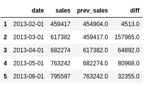
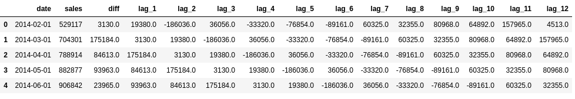
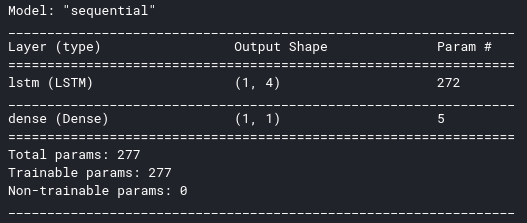
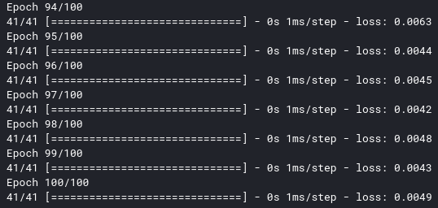
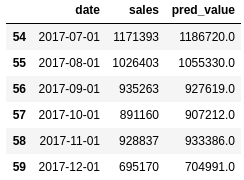
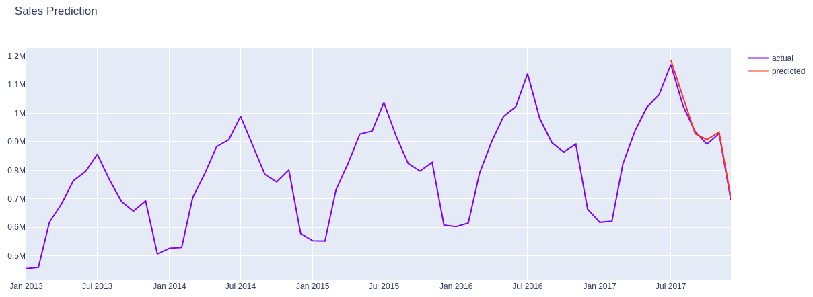

# Predicting Sales
Time series forecasting is one of the major building blocks of Machine Learning. There are many methods in the literature to achieve this like Autoregressive Integrated Moving Average (ARIMA), Seasonal Autoregressive Integrated Moving-Average (SARIMA), Vector Autoregression (VAR), and so on.

In this article, we will focus on Long Short-term Memory (LSTM) method for predicting future Sales.

## how does knowing the future sales helps our business?
* First of all, it is a benchmark. We can use it as the business as usual level we are going to achieve if nothing changes in our strategy. Moreover, we can calculate the incremental value of our new actions on top of this benchmark.
* Second, it can be utilized for planning. We can plan our demand and supply actions by looking at the forecasts. It helps to see where to invest more.
* Last but not least, it is an excellent guide for planning budgets and targets.

## Dataset
* We use the [dataset](https://www.kaggle.com/c/demand-forecasting-kernels-only) from a Kaggle competition. It represents the daily sales for each store and item.
Our Dataset looks like:
* 

## Data preprocessing

### Data wrangling
Our task is to forecast monthly total sales. We need to aggregate our data at the monthly level and sum up the sales column.
* After Data wrangling our data looks like this:
* 

### Data Transformation
To model our forecast easier and more accurate, we will do the transformations below:

* We will convert the data to stationary if it is not
* Converting from time series to supervised for having the feature set of our LSTM model
* Scale the data

Let's see each step by step:
#### convert the data to stationary if it is not
* Monthly sales chart
* 
Obviously, it is not stationary and has an increasing trend over the months. One method is to get the difference in sales compared to the previous month and build the model on it:
* the required dataframe for modeling the difference:
* 
* Monthly sales difference chart
* 
Perfect! Our Monthly sales difference is stationary.

#### Converting from time series to supervised for having the feature set of our LSTM model
we can start building our feature set. We need to use previous monthly sales data to forecast the next ones. The look-back period may vary for every model. Ours will be 12 for this project. Our Dataframe with features look like this:
* 

#### Scale the data
* But there is one more step before scaling. We should split our data into train and test sets. As the test set, we have selected the last 6 months’ sales.
* We will use MinMaxScaler from sklearn, which will scale each feature between -1 and 1.

## Building LSTM Model
* Create feature and label sets from scaled datasets.
* Our Model looks like:
* 
* Model loss decreases over time:
* 

## Prediction on test set
prediction on test set looks similar to actual value:
* 
* Results look similar but it doesn’t tell us much because these are scaled data that shows the difference. We can see the actual sales prediction by rescaling it to original form. After rescaling Actual vs predicted sales looks like:
* 
* Actual vs predicted sales chart for better visualization:
* 
* One improvement we can do for this model is to add holidays, breaks, and other seasonal effects. They can be simply added as a new feature.
